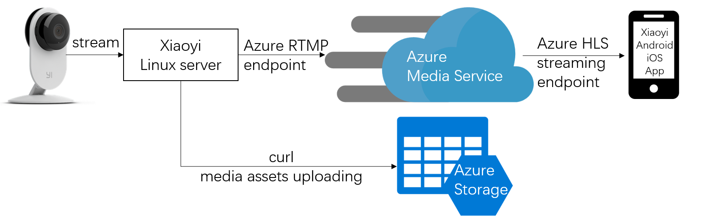
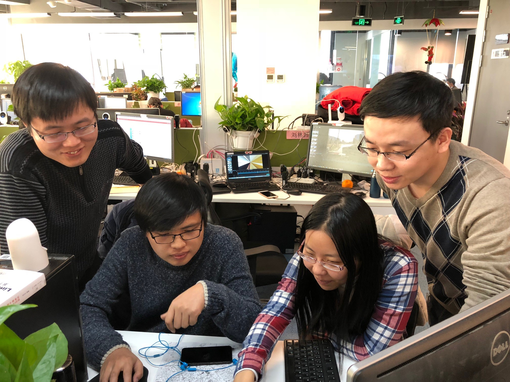

## Media Service integration project of Yi Technology

### Background
Xiaoyi is top intelligent camera provider in China, which is in Xiaomi device ecosystem. Xiaoyi aimed to implement live broadcast solution with their camera product and Azure Media Service, so that they can demo this feature at global CES event. 

### Problem
In this project, Xiaoyi was blocked by two technical problems of Azure Media Service (short for AMS)
1. How to integrate AMS live streaming endpoint (RTMP endpoint) in their hardware code
2. How to get the live event in their mobile application.

### Solution
CSE engineers were involved this project and solved the two problems mentioned above:
1. RTMP endpoint url correction:

RTMP endpoint url should be added with stream name defined by user himself. And this name must not be changed when appending more stream. Besides, the appended stream should have cumulative video starting time.

```RTMP Url
rtmp://AMSname.channel.mediaservices.windows.net:1935/live/channelid/streamname
````
2. Simulate the live streaming process with FFMPEG tool.

```FFMPEG
ffmpeg -re -i output.mp4 -c copy -f flv "rtmp url"
```

3. Get 1080p HLS stream in their Andoird and iOS App

The HLS playing url can be found in below image. A "format=m3u8-aapl" value should be added at the end. Then this url can be copied in web browser or mobile phone media player.


```HLS preview url
http://AMSname.channel.mediaservices.windows.net/channelid/manifest(format=m3u8-aapl)
```

### Architecture

Architecture of this live streaming solution is as below.


### Team

This project is delivered through onsite support and offsite hackfest.
- PM: Tao Yang
- SE: Ye Ma, Shijun Liu, Yuheng Ding

